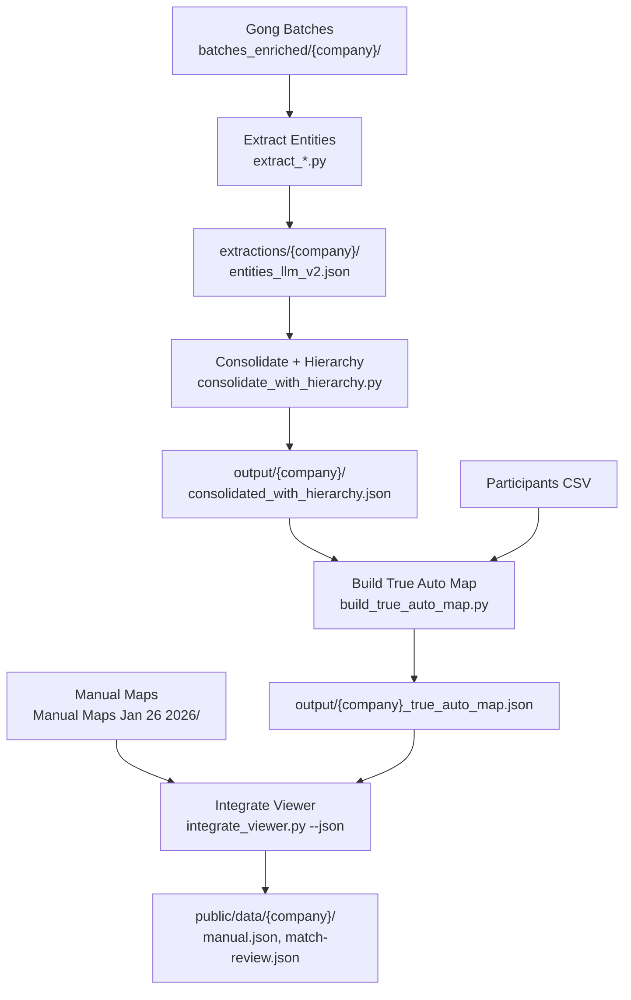

# GongOrgViewerStatic Architecture

## Overview

Extracts organizational intelligence from Gong call transcripts and enables user review/correction via a **Next.js 15 + React + Tailwind** web app. Two modes: Org Map (manual map with Gong evidence) and Match Review. Auto map was removed Feb 2026 — pipeline still generates it as an intermediate for enrichment, but it is not displayed.

**Rebuild status**: Migrated from Vite + vanilla TS to Next.js. See `docs/plans/2026-02-15-feat-nextjs-react-rebuild-plan.md`.

---

## Pipeline Flow



---

## Data Transformations by Stage

| Stage | Script | Input | Output | Key Transform |
|-------|--------|-------|--------|---------------|
| 1. Extract | `extract_*.py` | batches_enriched/ | entities_llm_v2.json | Transcript → entities |
| 2. Consolidate | `consolidate_with_hierarchy.py` | entities_llm_v2.json | consolidated_with_hierarchy.json | Dedupe, infer parents |
| 3. Build Map | `build_true_auto_map.py` | consolidated + CSV | _true_auto_map.json | Tree structure, resolve speakers |
| 4. Integrate | `integrate_viewer.py --json` | auto_map + manual_map | `public/data/{co}/*.json` | snake_case → camelCase |

---

## File Locations

```
GongOrgViewerStatic/
├── app/                                        # Next.js App Router
│   ├── layout.tsx                              # Global layout + header
│   ├── page.tsx                                # Redirect / → /manual/astrazeneca
│   ├── globals.css                             # Tailwind import
│   ├── manual/[company]/page.tsx               # Manual Map view
│   ├── match-review/[company]/page.tsx         # Match Review view
│   ├── not-found.tsx                           # 404 page
│   └── api/                                    # Next.js Route Handlers (Phase 2)
│       ├── org-state/route.ts                  # Consolidated KV CRUD
│       ├── match-review/route.ts               # Match decisions
│       ├── sync-version/route.ts               # Polling endpoint
│       └── autosave/route.ts                   # Session snapshots
├── lib/                                        # Pure TypeScript modules
│   ├── types.ts                                # All interfaces + KV state types
│   ├── tree-ops.ts                             # Pure tree traversal (no globals)
│   ├── build-working-tree.ts                   # Pure: applies overlays to display tree
│   ├── utils.ts                                # Formatting, normalization
│   └── use-kv-state.ts                         # React hook for KV data (Phase 2)
├── components/                                 # React components (Phase 3)
├── public/data/{company}/                      # Pipeline-generated JSON (gitignored)
│   ├── manual.json                             # Company manual map data
│   └── match-review.json                       # Match review items
├── next.config.ts                              # Next.js config
├── tsconfig.json                               # TypeScript config
├── postcss.config.mjs                          # Tailwind PostCSS config
├── vitest.config.ts                            # Test config
├── batches_enriched/{company}/batch_*.json     # Source transcripts
├── extractions/{company}/entities_llm_v2.json  # Raw LLM extractions
├── output/                                     # Pipeline intermediates
│   ├── {company}/consolidated_with_hierarchy.json
│   └── {company}_true_auto_map.json
├── "Manual Maps Jan 26 2026"/{company}_rd_map.json
├── src/                                        # Legacy Vite TS (reference, excluded from build)
├── api/                                        # Legacy serverless (reference, excluded from build)
└── public/js/                                  # Legacy viewer JS (reference)
```

### Build & Deploy

```bash
npm run build    # next build
npm run dev      # next dev (with HMR)
npm run test     # vitest run (52 tests)
vercel           # Deploy to Vercel (zero config)
```

---

## Field Name Mapping (Critical!)

**Rule**: Python = snake_case, Viewer JS = camelCase. Transform happens in `integrate_viewer.py`.

| Concept | Extraction | Consolidated | Auto Map | Viewer |
|---------|-----------|--------------|----------|--------|
| Entity name | `entity_name` or `value` | `entity_name` | `name` | `name` |
| Entity type | `entity_type` or `type` | `entity_type` | `type` | `type` |
| Call ID | `call_id` or `call_ids[]` | `call_id` | `callId` | `callId` |
| Quote text | `raw_quote` | `raw_quote` | `quote` | `quote` |
| Speaker ID | `speaker_id` | `speaker_id` | **DROPPED** | N/A |
| Gong URL | N/A | N/A | `gongUrl` | `gongUrl` |
| Evidence | N/A | N/A | `gong_evidence` | `gongEvidence` |

---

## Extraction Format Variations

| Script | Companies | Has speaker_id | Entity name field |
|--------|-----------|----------------|-------------------|
| `extract_gsk_az_novartis.py` | GSK, AZ, Novartis | Yes | `value` |
| `extract_entities.py` | AbbVie, others | No | `entity_name` |

---

## Viewer Data Structure (JSON)

### Manual Map (`public/data/{company}/manual.json`)
```typescript
{
  company: "AbbVie",
  source: "Manual Map - AbbVie",
  stats: { entities: number, matched: number, snippets: number },
  root: {
    id, name, type, leader,
    gongEvidence: {
      snippets: [...],
      sizeMentions: [...],
      matchedContacts: [...],
      totalMentions, confidence, status
    },
    children: [/* recursive OrgNode */]
  }
}
```

### Match Review (`public/data/{company}/match-review.json`)
```typescript
{
  generated: "ISO timestamp",
  total_unmatched: number,
  items: [{ id, gong_entity, snippet, llm_suggested_match, status, ... }]
}
```

---

## State Model (Next.js)

| State | Owner | Persistence |
|-------|-------|-------------|
| `company` | URL param `[company]` | URL |
| `mode` | URL path (`/manual` vs `/match-review`) | URL |
| `view` | `useState` in manual page | localStorage |
| `selectedNode` | `useState` in manual page | None |
| `dateRange` | `useState` in manual page | None |
| All KV data | `useKVState` hook | Vercel KV |

---

## API Endpoints (Vercel KV)

All endpoints: `Cache-Control: no-store`, account validation via `?account=` param.

| Endpoint | Key Pattern | Purpose |
|----------|-------------|---------|
| `/api/org-state?type=X` | `{type}:{account}` | Consolidated CRUD (8 types) |
| `/api/match-review` | `match-review:{account}` | Match decisions |
| `/api/sync-version` | `sync-version:{account}` | Multi-user sync polling |
| `/api/autosave` | `autosave:{account}` | Session state snapshots |

**org-state types:** corrections, field-edits, sizes, merges, graduated-map, manual-map-overrides, manual-map-modifications, resolutions

### Multi-User Sync
- Every write (except autosave) bumps `sync-version:{account}`
- Client polls `/api/sync-version` every 10 seconds
- On version change → reload all KV data, re-render

---

## Script Execution Order

```bash
python3 scripts/extract_entities.py --company abbvie
python3 scripts/consolidate_with_hierarchy.py --company abbvie
python3 scripts/build_true_auto_map.py --company abbvie
python3 scripts/integrate_viewer.py --json
vercel
```
