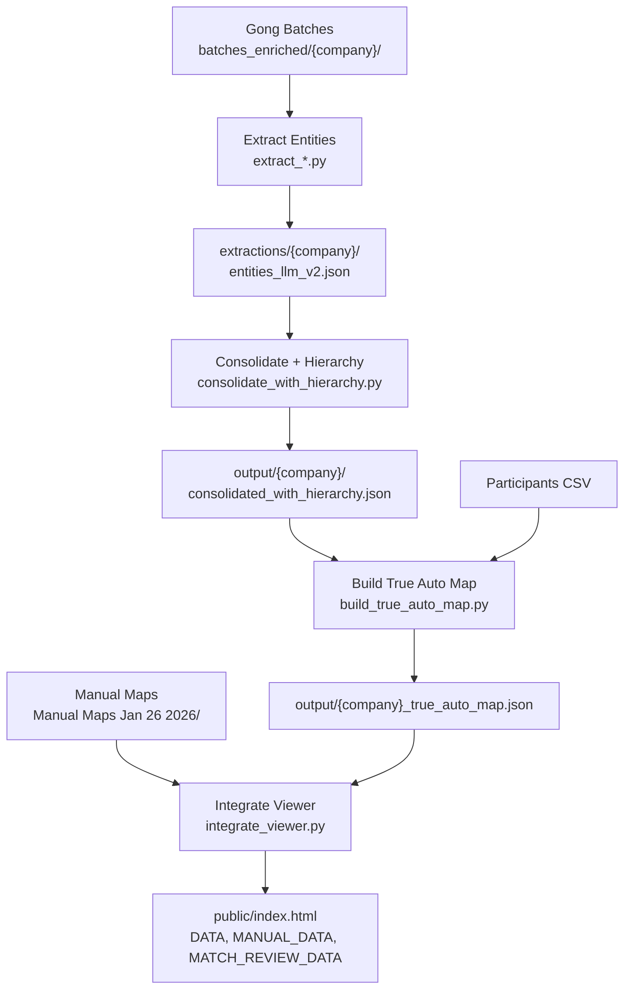

# GongOrgViewerStatic Architecture

## Overview

Extracts organizational intelligence from Gong call transcripts, builds auto-generated org charts, and enables user review/correction via a static HTML viewer.

---

## Pipeline Flow



---

## Data Transformations by Stage

| Stage | Script | Input | Output | Key Transform |
|-------|--------|-------|--------|---------------|
| 1. Extract | `extract_*.py` | batches_enriched/ | entities_llm_v2.json | Transcript → entities |
| 2. Consolidate | `consolidate_with_hierarchy.py` | entities_llm_v2.json | consolidated_with_hierarchy.json | Dedupe, infer parents |
| 3. Build Map | `build_true_auto_map.py` | consolidated + CSV | _true_auto_map.json | Tree structure, resolve speakers |
| 4. Integrate | `integrate_viewer.py` | auto_map + manual_map | index.html | snake_case → camelCase |

---

## File Locations

```
GongOrgViewerStatic/
├── batches_enriched/{company}/batch_*.json    # Source transcripts + participants
├── extractions/{company}/entities_llm_v2.json # Raw LLM extractions
├── output/
│   ├── {company}/consolidated_with_hierarchy.json
│   ├── {company}_true_auto_map.json           # CURRENT auto map
│   ├── {company}_enriched_auto_map.json       # LEGACY (deprecated)
│   └── {company}_enriched_match_review_data.json
├── "Manual Maps Jan 26 2026"/{company}_rd_map.json
└── public/index.html                          # Viewer with embedded data
```

---

## Field Name Mapping (Critical!)

**Rule**: Python = snake_case, Viewer JS = camelCase. Transform happens in `integrate_viewer.py`.

| Concept | Extraction | Consolidated | Auto Map | Viewer |
|---------|-----------|--------------|----------|--------|
| Entity name | `entity_name` or `value` | `entity_name` | `name` | `name` |
| Entity type | `entity_type` or `type` | `entity_type` | `type` | `type` |
| Call ID | `call_id` or `call_ids[]` | `call_id` | `callId` | `callId` |
| Quote text | `raw_quote` | `raw_quote` | `quote` | `quote` |
| Speaker ID | `speaker_id` | `speaker_id` | **DROPPED** | N/A |
| Gong URL | N/A | N/A | `gongUrl` | `gongUrl` |
| Evidence | N/A | N/A | `gong_evidence` | `gongEvidence` |

---

## Extraction Format Variations

**Different scripts produce different schemas:**

| Script | Companies | Has speaker_id | Entity name field |
|--------|-----------|----------------|-------------------|
| `extract_gsk_az_novartis.py` | GSK, AZ, Novartis | ✅ Yes | `value` |
| `extract_entities.py` | AbbVie, others | ❌ No | `entity_name` |

**Consolidation handles both** via:
```python
name = e.get("entity_name") or e.get("value")
```

---

## Viewer Data Structure

### DATA (Auto-extracted)
```javascript
DATA[company] = {
  company: "AbbVie",
  dateRange: { start: "2023-01-01", end: "2026-01-27" },
  stats: { entities, extractions, calls, snippets },
  root: {
    id, name, type, leader, size, mentions, confidence,
    snippets: [{ quote, date, callId, gongUrl, customerName, internalName }],
    sizeMentions: [{ value, snippetIndex, source: { callDate, customerName }}],
    children: [/* recursive */]
  }
}
```

### MANUAL_DATA (Ground truth)
```javascript
MANUAL_DATA[company] = {
  company: "AbbVie",
  root: {
    id, name, type, leader,
    gongEvidence: {
      snippets: [...],
      sizeMentions: [...],
      matchedContacts: [...],
      totalMentions, confidence, status
    },
    children: [/* recursive */]
  }
}
```

---

## Known Issues & Root Causes

| Issue | Root Cause | Fix Location |
|-------|------------|--------------|
| Speaker ID as numbers | `build_true_auto_map.py` drops `speaker_id` from snippet output | Line 148-158 |
| No leaders in Auto mode | Extraction doesn't capture "X leads Y" | Extraction prompt |
| Team size "no source" | Size extracted but not linked to source snippet | Consolidation |
| Inconsistent extraction | Different scripts for different companies | Standardize extraction |

---

## Script Execution Order

```bash
# Full pipeline for one company
python3 scripts/extract_entities.py --company abbvie
python3 scripts/consolidate_with_hierarchy.py --company abbvie
python3 scripts/build_true_auto_map.py --company abbvie
python3 scripts/integrate_viewer.py --update
vercel
```

---

## Viewer Display Logic

### Leader Display
- Shows `node.leader.name, node.leader.title` if present
- Shows "?, ?" placeholder if missing (level > 0)
- Looks up from manual map if not in auto map

### Team Size Display
Priority: User override → Selected mention → First mention → node.size
- Shows "⚠ no source" if `node.size` exists but `sizeMentions` empty

### Snippet Display
- Filters by date range
- Shows: quote, date, customerName, internalName, gongUrl link

---

## API Endpoints (Vercel KV)

| Endpoint | Key Pattern | Purpose |
|----------|-------------|---------|
| `/api/corrections` | `corrections:{account}` | Hierarchy overrides |
| `/api/field-edits` | `field-edits:{account}` | Name/title edits |
| `/api/match-review` | `match-review:{account}` | Match decisions |
| `/api/merges` | `merges:{account}` | Entity consolidation |

---

## Company Stats

| Company | Extractions | Consolidated | Auto Map Nodes | Manual Map Nodes |
|---------|-------------|--------------|----------------|------------------|
| AbbVie | ~500 | ~50 | 12 | ~30 |
| AstraZeneca | ~800 | ~100 | 23 | ~40 |
| GSK | ~700 | ~80 | 19 | ~35 |
| Lilly | ~600 | ~50 | 14 | ~25 |
| Novartis | ~700 | ~80 | 20 | ~35 |
| Regeneron | ~500 | ~30 | 0 | ~20 |
| Roche | 881 | 34 | 34 | ~25 |
