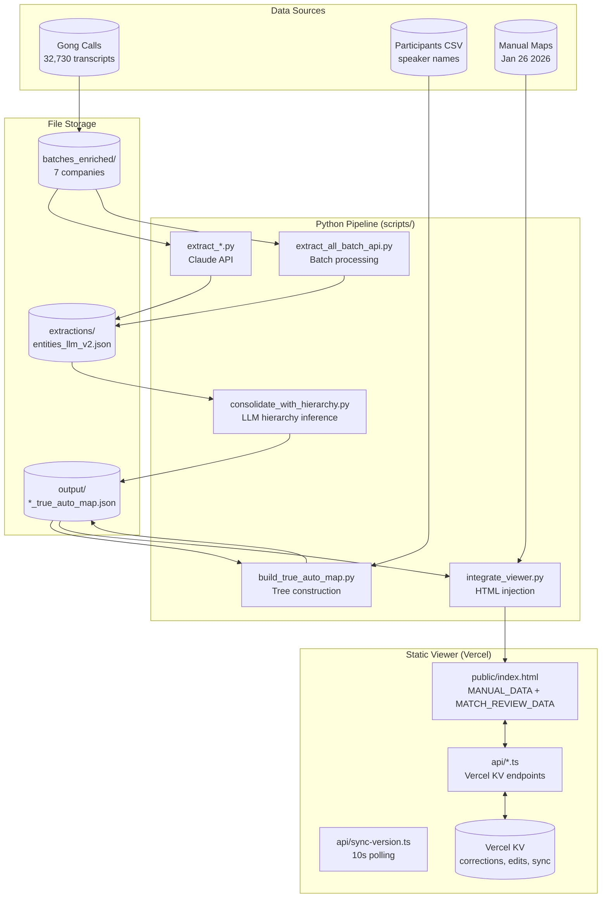
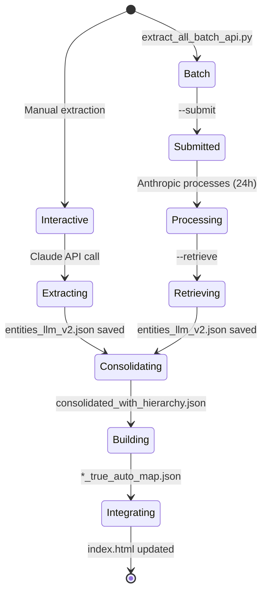

# System Architecture Overview

## Component Hierarchy



## File System Layout

```mermaid
flowchart LR
    subgraph Root["GongOrgViewerStatic/"]
        direction TB
        subgraph Data["Data Directories"]
            BE[batches_enriched/\n{company}/batch_*.json]
            EX[extractions/\n{company}/entities_llm_v2.json]
            OUT[output/\n{company}_true_auto_map.json]
            MM[Manual Maps Jan 26 2026/\n{company}_rd_map.json]
        end
        subgraph Code["Code"]
            SC[scripts/\nPython pipeline]
            API[api/\nVercel serverless]
            PUB[public/\nStatic viewer]
            BAT[batches/\nextractor_prompt_v5.md]
        end
        subgraph Config["Config"]
            CL[CLAUDE.md\nAI instructions]
            PKG[package.json\nVercel config]
        end
    end

    BE --> EX
    EX --> OUT
    OUT --> PUB
    MM --> PUB
```

## API Endpoints

```mermaid
flowchart TB
    subgraph Client["Viewer (Browser)"]
        UI[index.html]
    end

    subgraph API["Vercel Serverless Functions"]
        C[/api/corrections\nHierarchy moves]
        FE[/api/field-edits\nName/title changes]
        MR[/api/match-review\nContact linking]
        ME[/api/merges\nEntity consolidation]
        SZ[/api/sizes\nTeam size updates]
        GM[/api/graduated-map\nManual map KV overlay]
        SV2[/api/sync-version\nPolling endpoint]
        AS[/api/autosave\nAuto-persistence]
    end

    subgraph KV["Vercel KV"]
        K1[(corrections:{account})]
        K2[(field-edits:{account})]
        K3[(match-review:{account})]
        K4[(merges:{account})]
        K5[(sync-version:{account})]
    end

    UI -->|"10s poll"| SV2
    UI --> C & FE & MR & ME & SZ & GM & AS
    C --> K1
    FE --> K2
    MR --> K3
    ME --> K4
    SV2 --> K5
    C & FE & MR & ME & SZ & GM -->|bumpSyncVersion| K5
```

## Processing Modes



## Key Patterns

| Pattern | Location | Description |
|---------|----------|-------------|
| Dual extraction formats | consolidate_with_hierarchy.py:80-98 | Handles both `entity_name` and `value` formats |
| Speaker filtering | extract_roche_with_claude.py:23-70 | Filters out BioRender speakers |
| Gong URL construction | build_true_auto_map.py:87-95 | Maps call_id → full Gong URL |
| Field mapping | build_true_auto_map.py:148-180 | Python snake_case → JS camelCase |
| Rate limiting | consolidate_with_hierarchy.py:33 | 1.0s delay between LLM calls |

## Companies Supported

| Company | Key | Display Name |
|---------|-----|--------------|
| abbvie | `abbvie` | AbbVie |
| astrazeneca | `astrazeneca` | AstraZeneca |
| gsk | `gsk` | GSK |
| lilly | `lilly` | Eli Lilly |
| novartis | `novartis` | Novartis |
| regeneron | `regeneron` | Regeneron |
| roche | `roche` | Roche |
