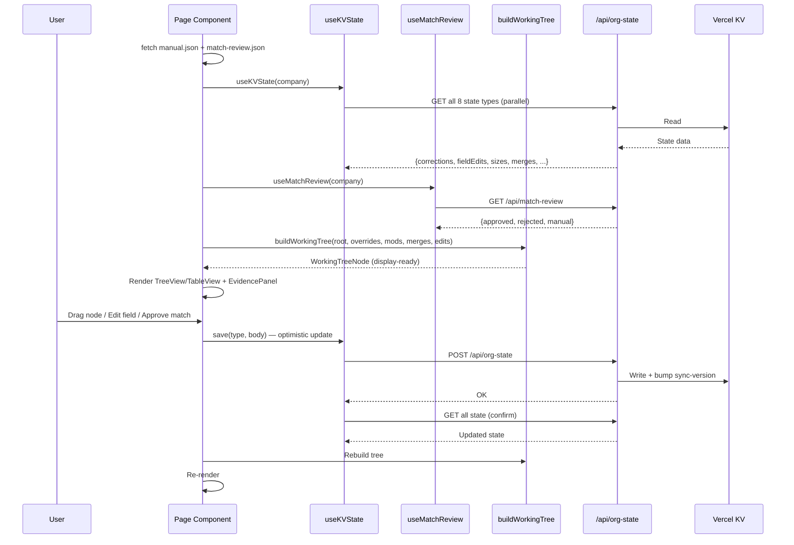
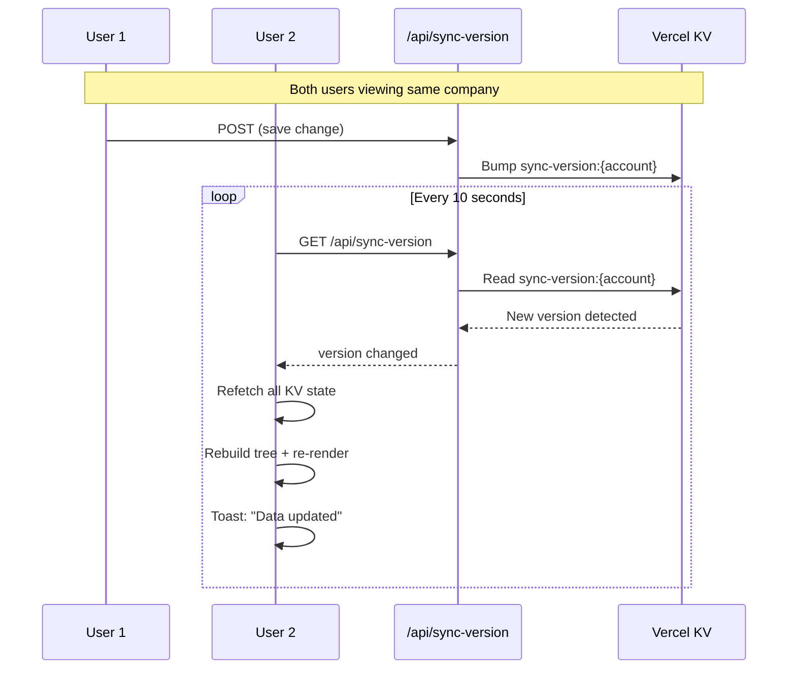

# System Architecture Overview

## Component Hierarchy

```mermaid
flowchart TB
    subgraph Layout["App Layout (layout.tsx)"]
        H[Header.tsx<br/>Company select + mode tabs + refresh]
    end

    subgraph OrgMap["Org Map Page (/manual/[company])"]
        OM_D[Fetch manual.json + match-review.json]
        OM_KV[useKVState hook]
        OM_MR[useMatchReview hook]
        OM_BWT[buildWorkingTree — apply overlays]
        TV[TreeView — drag-drop tree]
        TBV[TableView — sortable table]
        EP[EvidencePanel — snippets + size + contacts]
        SCM[SnippetContextModal — transcript context]
        MEM[ManageEntitiesModal — create/delete/merge]
    end

    subgraph MatchReview["Match Review Page (/match-review/[company])"]
        MR_D[Fetch match-review.json + manual.json]
        MR_KV[useKVState hook]
        MR_MR[useMatchReview hook]
        MRT[MatchReviewTable — filter/approve/reject]
        EPM[EntityPickerModal — manual match]
    end

    subgraph API["Vercel API Routes"]
        OS["/api/org-state<br/>8 state types CRUD"]
        MRA["/api/match-review<br/>Decision CRUD"]
        SV["/api/sync-version<br/>Poll endpoint"]
        AS["/api/autosave<br/>Session snapshots"]
    end

    subgraph KV["Vercel KV"]
        KVD[(corrections, field-edits,<br/>sizes, merges,<br/>manual-map-overrides,<br/>manual-map-modifications,<br/>graduated-map, resolutions,<br/>match-review, sync-version,<br/>autosave)]
    end

    subgraph Pipeline["Python Pipeline"]
        EXT[extract_entities.py]
        CON[consolidate_with_hierarchy.py]
        BLD[build_true_auto_map.py]
        INT[integrate_viewer.py --json]
        TX[(batches_enriched/)]
        JSON[public/data/{co}/<br/>manual.json + match-review.json]
    end

    H --> OrgMap
    H --> MatchReview

    OM_D --> OM_BWT
    OM_KV --> OM_BWT
    OM_MR --> EP
    OM_BWT --> TV
    OM_BWT --> TBV
    TV --> EP
    TBV --> EP
    EP --> SCM

    MR_D --> MRT
    MR_MR --> MRT
    MRT --> EPM

    OM_KV <--> OS
    MR_KV <--> OS
    OM_MR <--> MRA
    MR_MR <--> MRA
    OM_KV -.->|poll 10s| SV
    OS <--> KV
    MRA <--> KV
    SV <--> KV

    EXT --> CON --> BLD --> INT
    TX --> INT
    INT --> JSON
    JSON --> OM_D
    JSON --> MR_D
```

## Data Flow: Render Cycle



## Multi-User Sync



## Key Architectural Patterns

| Pattern | Location | Description |
|---------|----------|-------------|
| Static JSON + KV overlay | Pages + buildWorkingTree | Base data from pipeline JSON, modifications from KV |
| Optimistic updates | useKVState.save() | Update local state immediately, POST async, refetch to confirm |
| Sync polling | useKVState (10s interval) | Poll sync-version, reload on change |
| Pure tree ops | lib/tree-ops.ts, lib/build-working-tree.ts | No side effects, no global state |
| Discriminated union API | /api/org-state | Single endpoint handles 8 state types via `type` param |
| Context extraction fallbacks | integrate_viewer.py | 6-strategy progressive matching for 100% snippet context |
| Quote replacement | integrate_viewer.py | Paraphrased LLM quotes replaced with exact transcript text |
| Refresh store | lib/refresh-store.ts | useSyncExternalStore bridges Header ↔ Page refresh |

## File Map

| Layer | Files |
|-------|-------|
| Pages | `app/manual/[company]/page.tsx`, `app/match-review/[company]/page.tsx` |
| Components | `components/{Header,TreeView,TableView,EvidencePanel,SnippetContextModal,MatchReviewTable,EntityPickerModal,ManageEntitiesModal,Toast}.tsx` |
| Hooks | `lib/use-kv-state.ts`, `lib/use-match-review.ts`, `lib/refresh-store.ts` |
| Pure logic | `lib/build-working-tree.ts`, `lib/tree-ops.ts`, `lib/match-helpers.ts`, `lib/utils.ts` |
| Types | `lib/types.ts` |
| API | `app/api/{org-state,match-review,sync-version,autosave}/route.ts` |
| KV client | `app/api/_lib/kv.ts`, `app/api/_lib/validation.ts` |
| Pipeline | `scripts/{extract_entities,consolidate_with_hierarchy,build_true_auto_map,integrate_viewer}.py` |
| Data | `public/data/{co}/manual.json`, `public/data/{co}/match-review.json` |
| Tests | `lib/*.test.ts` (52 tests) |

## Companies Supported

| Company | Key | Display Name |
|---------|-----|--------------|
| abbvie | `abbvie` | AbbVie |
| astrazeneca | `astrazeneca` | AstraZeneca |
| gsk | `gsk` | GSK |
| lilly | `lilly` | Eli Lilly |
| novartis | `novartis` | Novartis |
| regeneron | `regeneron` | Regeneron |
| roche | `roche` | Roche |
