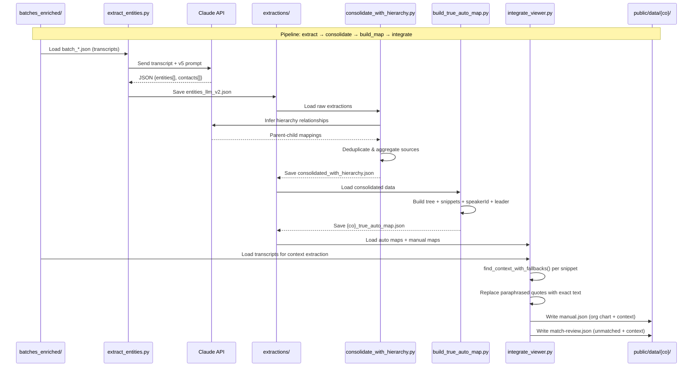
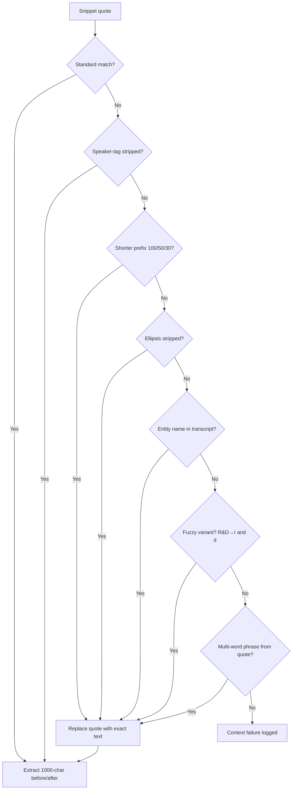
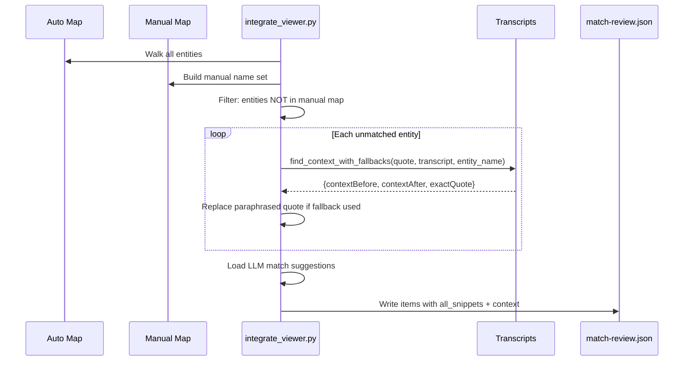

# Extraction & Integration Pipeline Flow

## Full Pipeline (batches → viewer JSON)

## Context Extraction (integrate_viewer.py)

## Match Review Generation

## Key Data Transformations

| Stage | Input | Output | Key Fields Added |
|-------|-------|--------|------------------|
| Extract | transcript | entities_llm_v2.json | entity_name, entity_type, speaker_id, raw_quote |
| Consolidate | entities_llm_v2.json | consolidated_with_hierarchy.json | parent_id, leader, leader_title, all_sources |
| Build Map | consolidated_with_hierarchy.json | {co}_true_auto_map.json | speakerId, gongUrl, customerName, tree structure |
| Integrate | *_true_auto_map.json + transcripts | manual.json, match-review.json | contextBefore, contextAfter, callTitle, exact quotes |

## Coverage (2026-02-16)

| Company | Org Chart Snippets | Match Review Snippets | Total | Context Coverage |
|---------|-------------------|----------------------|-------|-----------------|
| abbvie | 14 | 210 | 224 | 100% |
| astrazeneca | 27 | 434 | 461 | 100% |
| gsk | 5 | 250 | 255 | 100% |
| lilly | 2 | 92 | 94 | 100% |
| novartis | 29 | 238 | 267 | 100% |
| regeneron | 1 | 34 | 35 | 100% |
| roche | 3 | 197 | 200 | 100% |
| **TOTAL** | **81** | **1455** | **1536** | **100%** |
