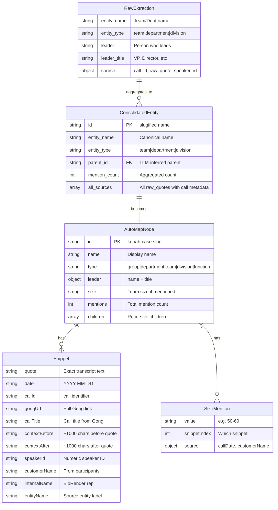
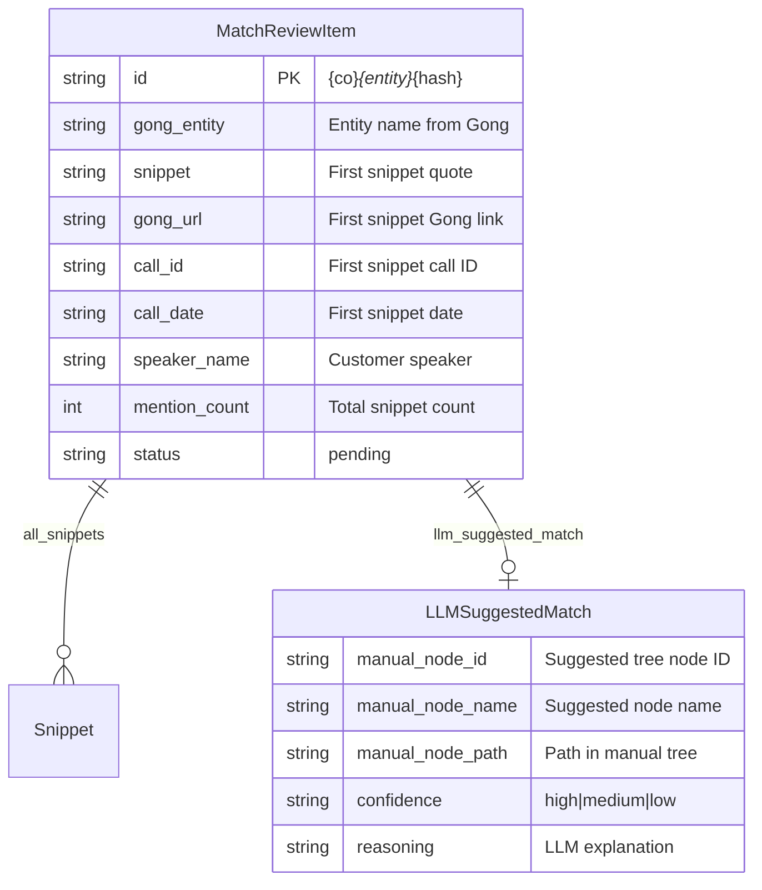

# Data Models Schema

## Pipeline Data → Viewer Data

## Vercel KV State (per company account)

```mermaid
erDiagram
    OrgState ||--o{ Override : "corrections"
    OrgState ||--o{ FieldEdit : "field-edits"
    OrgState ||--o{ SizeOverride : "sizes"
    OrgState ||--o{ EntityMerge : "merges"
    OrgState ||--o| CompanyData : "graduated-map"
    OrgState ||--o{ ManualMapOverride : "manual-map-overrides"
    OrgState ||--o| CompanyModifications : "manual-map-modifications"
    OrgState ||--o{ Resolution : "resolutions"
    MatchDecisions ||--o{ MatchDecision : "approved|rejected|manual"

    Override {
        string entityId PK "corrections:{account}"
        string originalParent "Before move"
        string newParent "After move"
        string movedAt "ISO timestamp"
    }

    FieldEdit {
        string entityId PK "field-edits:{account}"
        object name "original + edited"
        object leaderName "original + edited"
        object leaderTitle "original + edited"
        string savedAt "ISO timestamp"
    }

    SizeOverride {
        string key PK "sizes:{account} key={co}:{nodeId}"
        int selectedSizeIndex "nullable"
        string customValue "nullable"
        string updatedAt "ISO timestamp"
    }

    EntityMerge {
        string canonicalId PK "merges:{account}"
        array absorbed "Entity IDs merged in"
        array aliases "Display name aliases"
        string mergedAt "ISO timestamp"
    }

    ManualMapOverride {
        string nodeId PK "manual-map-overrides:{account}"
        string originalParent "Before drag"
        string newParent "After drag"
        string newParentName "Display name"
        string movedAt "ISO timestamp"
    }

    CompanyModifications {
        array added "id, name, parentId, addedAt"
        array deleted "id, deletedAt"
    }

    MatchDecision {
        string itemId PK "match-review:{account}"
        string manualNodeId "Target entity ID"
        string manualNode "Target entity name"
        string manualPath "Path in tree"
        string approvedAt "or rejectedAt"
    }
```

## Match Review Item (from pipeline)

## Field Name Mapping (Python → TypeScript)

| Python (snake_case) | TypeScript (camelCase) | Stage |
|---------------------|------------------------|-------|
| `call_id` | `callId` | integrate_viewer |
| `raw_quote` | `quote` | integrate_viewer |
| `speaker_id` | `speakerId` | integrate_viewer |
| `gong_url` | `gongUrl` | integrate_viewer |
| `entity_name` | `name` | integrate_viewer |
| `entity_type` | `type` | integrate_viewer |
| `call_date` | `date` | integrate_viewer |
| `gong_evidence` | `gongEvidence` | integrate_viewer |
| `context_before` | `contextBefore` | integrate_viewer |
| `context_after` | `contextAfter` | integrate_viewer |

## Statistics (2026-02-16)

| Company | Entities | Snippets | Context% | Leaders |
|---------|----------|----------|----------|---------|
| abbvie | 164 | 223 | 100% | 4 |
| astrazeneca | 280 | 459 | 100% | 20 |
| gsk | 181 | 254 | 100% | 6 |
| lilly | 59 | 94 | 100% | 1 |
| novartis | 129 | 267 | 100% | 6 |
| regeneron | 24 | 35 | 100% | 1 |
| roche | 112 | 199 | 100% | 5 |
| **TOTAL** | **949** | **1531** | **100%** | **43** |
